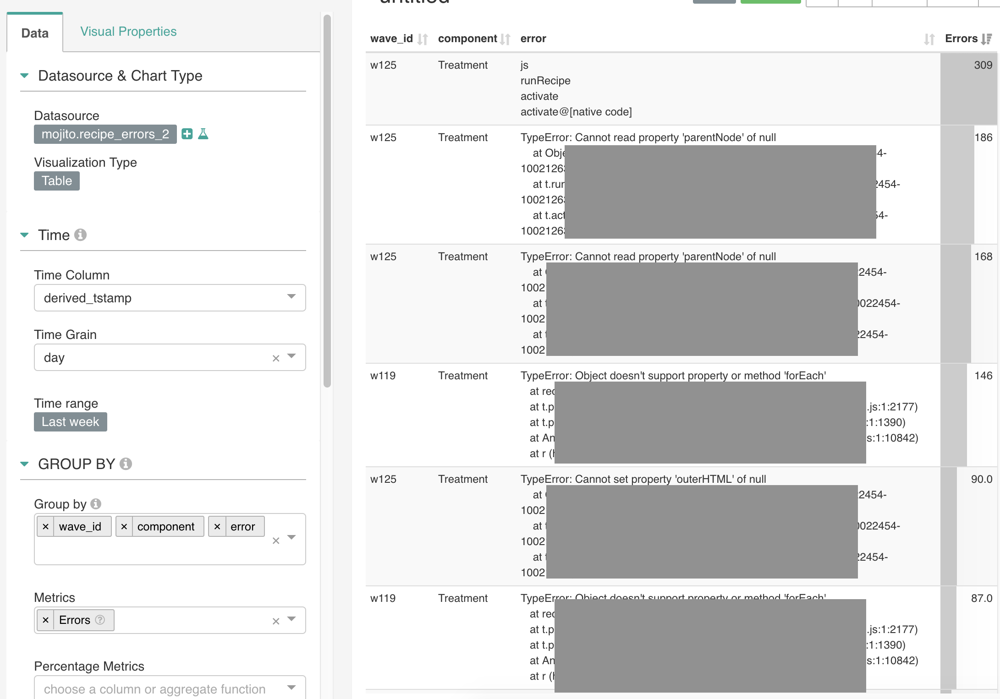

# Mojito Snowplow/Redshift data models

For measuring causality, we only count conversions taking place **after** a user is bucketed into a test. Tracking events before exposure to a variant only confounds the results.

Mojito does this by cherry-picking two types of events:

1. **[First exposures](base_exposures.sql)**: Each subject's first exposure to a variant
2. **[All conversions](conversions.sql)**: Every distinct conversion event a subject triggers

Then, our reporting logic performs the attribution based on users' event sequences:

| Time  | A subject's event stream | Event counted in reports?                             |
|-------|--------------------------|-------------------------------------------------------|
| 12:01 | Conversion               | ❗ Converted *(but before exposure / not counted)*     |
| 12:02 | Exposure                 | ✅ First exposure                                      |
| 12:03 | Conversion               | ✅ Converted                                           |
| 12:04 | Exposure                 | ❌                                                     |
| 12:05 | Conversion               | ✅ Converted again *(if measuring multiple goal hits)* |

Think "event sequencing" in GA's advanced segments... but with better assurances of when events arrived via Snowplow.

## Table naming conventions

Mint Metrics uses a multi-tenanted solution becuase we service multiple clients (`client`). At the same time, we also support different units of assignment (`unit`). These two factors go into naming our tables for access within reports:

 - **Exposure tables**: mojito.exposures_`unit`
    - usercookie: Snowplow's domain user ID / first party cookie ID *(Recommended)*
    - sessioncookie: Snowplow's domain session ID cookie
    - userfingerprint: Snowplow's user fingerprint and the user IP address combined into one field
 - **Conversion tables**: mojito.`client`_conversions_`unit`
    - e.g. 'mintmetrics' or whatever you use for the app_id

### Example

If the client was Mint Metrics and we were running a test assigned at the session-level, we would have to populate two tables for reports:

1. `mojito.exposures_sessioncookie`: For exposure tracking
2. `mojito.mintmetrics_conversions_sessioncookie`: For conversion data

## Setting up your data models

### 1. Create and define your mojito schema

This is the schema we use to store all Mojito report tables in. It also makes it easy to lock down access for your reporting user:

```sql{}
CREATE SCHEMA IF NOT EXISTS mojito;
GRANT USAGE ON SCHEMA TO username;
```

### 2. Define your exposure tables

Take [the `base_exposures.sql` example](base_exposures.sql) and adapt it to your requirements, paying close attention to:

 - Lines 1 and 18: Unit (if you're selecting a unit other than the first-party cookie ID)
 - Line 3: In case you want to override your app ID and it's not relevant to you. E.g. you could replace it with "company_name" instead.
 - Line 20-29: Bot filtering - you may have your own method for filtering bots out of your dataset.
 - [Table naming conventions as described above](#table-naming-conventions) (reports reference tables regularly and they need consistency)

```sql{3,4,18,20-29}
-- Exposures table
SELECT
	domain_userid AS subject,
	app_id as client_id,
	recipe as recipe_name,
	x.wave_id,
	-- Get the first exposure timestamp
	min(derived_tstamp) AS exposure_time
FROM atomic.events e
INNER JOIN atomic.io_mintmetrics_mojito_mojito_exposure_1 x
	ON e.event_id = x.root_id AND e.collector_tstamp = x.root_tstamp
WHERE e.event_name = 'mojito_exposure'
	AND e.event_version = '1-0-0'

	-- Handle cases where the unit is not set
	AND e.domain_userid IS NOT NULL

	-- Internal traffic & bot exclusion
	AND NOT (
	case 
		when app_id = 'mintmetrics' then user_ipaddress in (
		SELECT ip_address FROM mintmetrics.ip_exclusions UNION SELECT user_ipaddress FROM snowplow_intermediary.bot_ipaddress_exclusion_1
		)
	end
	)
GROUP BY 1, 2, 3, 4
```

Again, remember to pay close attention to the naming of your tables.


### 3. Define your conversion tables & conversion points

Using [the `conversions.sql` example](conversions.sql), adapt it to your requirements:

 - Line 2 & 22: Configure your subject
 - Line 4-11: Use CASE WHEN to categorise your events and classify them for easy access in reports - this means we can select and match conversion events on one field with regex in our reports.
 - Line 20: Define your app ID in the WHERE clause or pull the data from a particular table or schema
 - Line 23: Ensure all your pertinent conversion events are selected in this condition
 - [Remember the naming conventions for tables](#table-naming-conventions) when Creating the table inside the Mojito Schema

```sql{2, 4-11, 20, 22, 23}
    SELECT
        domain_userid AS subject,
        -- This is the value for the goal
        CASE 
            WHEN event = 'struct' THEN
                se_category || ' ' || se_action
            WHEN event = 'page_view' THEN
                'page_view ' || page_urlpath
            WHEN event = 'transaction' THEN
                'purchase'
        END AS goal,

        -- This is used for revenue reporting
        tr_total AS revenue,
        
        -- Aggregate over the first event id (in case your Snowplow pipeline is generating duplicates)
        Min(derived_tstamp) AS conversion_time

    FROM
        mintmetrics.events
    WHERE
        domain_userid IS NOT NULL
        and event in ('page_view', 'struct', 'transaction')
    GROUP BY
        -- We group by the transaction ID or event ID to ensure we're not double-counting events
        1, 2, 3, nvl(tr_orderid, event_id)

    ORDER BY conversion_time
```


### 4. Adding data modelling steps to Snowplow SQL Runner

Finally, you'll want to rebuild these tables as fresh data loads after each batch.:

```{yaml}
# ...
steps:
  - name: Exclusion filters
    queries:
      - name: Bot exclusions
        file: bot_ip_exclusion.sql
  - name: Mojito base
    queries:
      - name: Mojito exposures
        file: mojito/base_exposures.sql
  - name: Mojito errors
    queries:
      - name: Errors
        file: mojito/recipe_errors_2.sql
  - name: Mojito conversions
    queries:
      - name: Mint Metrics
        file: mojito/conversions/mintmetrics.sql

```


## Error tracking & attribution

NB. This is set to change shortly as we lock down the requirements for this feature in reports.

For error reporting, you'll need to build another table that should give you plenty of juicy context to find and fix errors:

```sql{}
SELECT
    app_id as client_id,
    domain_userid as subject,
    wave_id,
    component,
    error,
    page_urlhost,
    page_urlpath,
    ua.os_family,
    ua.device_family,
    ua.useragent_family,
    ua.useragent_major,
    derived_tstamp
FROM atomic.events e
INNER JOIN atomic.io_mintmetrics_mojito_mojito_failure_1 f
    ON e.event_id = f.root_id
        and e.collector_tstamp = f.root_tstamp
        and e.event_name = 'mojito_failure'
LEFT JOIN atomic.com_snowplowanalytics_snowplow_ua_parser_context_1 ua
    ON f.root_id = ua.root_id 
        and f.root_tstamp = ua.root_tstamp
```

We use the User Agent Parser enrichment in Snowplow to classify useragents. Page URLs, variant (components) and error messages also provide heaps of context for debugging.

This table makes for useful Superset dashboards too:



Whilst this event is optional to track and collect, we highly recommend it since [error tracking provides you with better assurances when you run your experiments](https://mintmetrics.io/experiments/why-you-need-error-tracking-handling-in-your-split-tests/).


## Get involved

We'll need help supporting other Snowplow Storage Targets, like Big Query and Azure's Data Lake product (eventually).

Feel free to reach out to us:

* [Open an issue on Github](https://github.com/mint-metrics/mojito-snowplow-storage/issues/new)
* [Mint Metrics' website](https://mintmetrics.io/)
